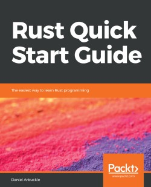
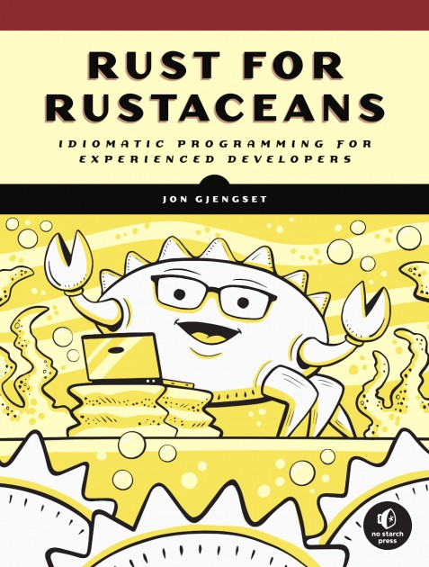
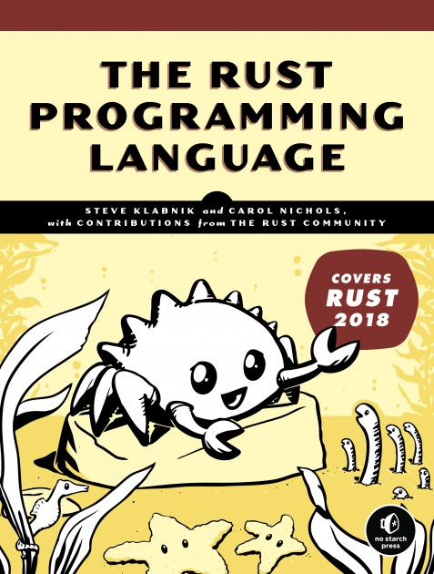
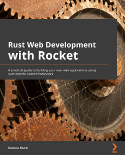
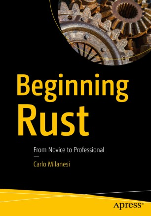
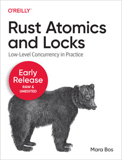

# Books

## >>> [**Beginning Rust Programming**](https://www.wiley.com/en-gb/Beginning+Rust+Programming-p-9781119712978)  

Ric Messier  
April 2021 - ISBN: 978-1-119-71297-8  

---

## >>> [**Rust in Action Systems programming concepts and techniques**](https://www.manning.com/books/rust-in-action)  

Tim McNamara  
June 2021 - ISBN 9781617294556  

---

## >>> [**Hands-on Rust - Effective Learning through 2D Game Development and Play**](https://pragprog.com/titles/hwrust/hands-on-rust/)  

by Herbert Wolverson  
Edition: 1 - Published: July 2021 - ISBN: 9781680508161  

---

## >>> [Command-Line Rust](https://www.oreilly.com/library/view/command-line-rust/9781098109424/)  

Ken Youens-Clark  
January 2022 - ISBN 9781098109431

---
---

[Programming WebAssembly with Rust - Unified Development for Web, Mobile, and Embedded Applications](https://pragprog.com/titles/khrust/programming-webassembly-with-rust/)  

by Kevin Hoffman  
Edition: 1 - Published: March 2019 - ISBN: 9781680506365  

---

[Rust Brain Teasers - Exercise Your Mind](https://pragprog.com/titles/hwrustbrain/rust-brain-teasers/)  

by Herbert Wolverson  
Edition: 1 - Published: March 2022 - ISBN: 9781680509175  

---

[Rust Web Development](https://www.manning.com/books/rust-web-development?query=rust)  

Bastian Gruber  
Fall 2022 - ISBN 9781617299001

---

[Rust Servers, Services, and Apps](https://www.manning.com/books/rust-servers-services-and-apps?query=rust)  

Prabhu Eshwarla  
Fall 2022 - ISBN 9781617298608

---

[Code Like a Pro in Rust](https://www.manning.com/books/code-like-a-pro-in-rust?query=rust)  

Brenden Matthews  
Early 2023 - ISBN 9781617299643

---

[Zero To Production In Rust An introduction to backend development](https://www.zero2prod.com/)  

Luca Palmieri 
n/a - ISBN: n/a

---

[Programming Rust, 2nd Edition](https://www.oreilly.com/library/view/programming-rust-2nd/9781492052586/)  

by Jim Blandy, Jason Orendorff, Leonora F. S. Tindall  
June 2021 - ISBN: 9781492052593

---

[Beginning Rust: Get Started with Rust 2021 Edition](https://www.oreilly.com/library/view/beginning-rust-get/9781484272084/)  
by Carlo Milanesi  
January 2022 - ISBN 9781484272084  

---

[Rust Web Programming](https://www.oreilly.com/library/view/rust-web-programming/9781800560819/)  
by Maxwell Flitton  
February 2021 - ISBN: 9781800560819  

---

[Speed Up Your Python with Rust](https://www.oreilly.com/library/view/speed-up-your/9781801811446/)  
by Maxwell Flitton  
January 2022 - ISBN: 9781801811446  

---

[Practical System Programming for Rust Developers](https://www.oreilly.com/library/view/practical-system-programming/9781800560963/)  
by Prabhu Eshwarla  
December 2020 - ISBN: 9781800560963  

---

[Rust for Rustaceans](https://www.oreilly.com/library/view/rust-for-rustaceans/9781098129828/)  
by Jon Gjengset  
December 2021 - ISBN: 9781718501850  

---

[Practical Machine Learning with Rust: Creating Intelligent Applications in Rust](https://www.oreilly.com/library/view/practical-machine-learning/9781484251218/)  
by Joydeep Bhattacharjee  
December 2019 - ISBN: 9781484251218  

---

[Network Programming with Rust](https://www.oreilly.com/library/view/network-programming-with/9781788624893/)  
by Abhishek Chanda  
February 2018 - ISBN: 9781788624893  

---

[Rust Programming Cookbook](https://www.packtpub.com/product/rust-programming-cookbook/9781789530667)  
by Claus Matzinger  
October 2019 - ISBN: 9781789530667  

---

[Hands-On Microservices with Rust](https://www.packtpub.com/product/hands-on-microservices-with-rust/9781789342758)  
by Denis Kolodin  
January 2019 - ISBN: 9781789342758  

---

[Creative Projects for Rust Programmers](https://www.packtpub.com/product/creative-projects-for-rust-programmers/9781789346220)  
by Carlo Milanesi  
June 2020 - ISBN: 9781789346220  

---

[Hands-On Data Structures and Algorithms with Rust](https://www.packtpub.com/product/hands-on-data-structures-and-algorithms-with-rust/9781788995528)  
by Claus Matzinger  
January 2019 - ISBN: 9781788995528  

---

[Rust Quick Start Guide](https://www.packtpub.com/product/rust-quick-start-guide/9781789616705)  
By Daniel Arbuckle  
October 2018 - ISBN 9781789616705  

---

[Practical Rust Projects: Building Game, Physical Computing, and Machine Learning Applications](https://www.oreilly.com/library/view/practical-rust-projects/9781484255995/)  
by Shing Lyu  
February 2020 - ISBN: 9781484255995  

---

[Practical Rust Web Projects: Building Cloud and Web-Based Applications](https://www.oreilly.com/library/view/practical-rust-web/9781484265895/)  
by Shing Lyu  
January 2021 - ISBN: 9781484265895  

---

[Mastering Rust - Second Edition](https://www.packtpub.com/product/mastering-rust-second-edition/9781789346572)  
by Rahul Sharma, Vesa Kaihlavirta  
January 2019 - ISBN: 9781789346572  

---

[Getting Started with Secure Embedded Systems: Developing IoT Systems for micro:bit and Raspberry Pi Pico Using Rust and Tock](https://www.oreilly.com/library/view/getting-started-with/9781484277898/)  
by Alexandru Radovici, Ioana Culic  
January 2022 - ISBN: 9781484277898  

---

[Rust for the IoT: Building Internet of Things Apps with Rust and Raspberry Pi](https://www.oreilly.com/library/view/rust-for-the/9781484258606/)  
by Joseph Faisal Nusairat  
Released  - ISBN: 9781484258606  

---

[Rust Standard Library Cookbook](https://www.oreilly.com/library/view/rust-standard-library/9781788623926/)  
by Jan Nils Ferner, Daniel Durante  
Released  - ISBN: 9781788623926  

---

[Hands-On Functional Programming in Rust](https://www.oreilly.com/library/view/hands-on-functional-programming/9781788839358/)  
by Andrew Johnson
May 2018 - ISBN: 9781788839358  

---

[Rust Programming By Example](https://www.oreilly.com/library/view/rust-programming-by/9781788390637/)  
by Guillaume Gomez, Antoni Boucher  
January 2018 - ISBN: 9781788390637  

---

[Rust High Performance](https://www.oreilly.com/library/view/rust-high-performance/9781788399487/)  
by Iban Eguia Moraza  
March 2018 - ISBN: 9781788399487  

---

[Hands-On Concurrency with Rust](https://www.oreilly.com/library/view/hands-on-concurrency-with/9781788399975/)  
by Brian L. Troutwine  
May 2018 - ISBN: 9781788399975  

---

[Fullstack Rust](https://www.newline.co/fullstack-rust)  
Andy Weiss  
? - ?  

---

[Rust for Rustaceans - Idiomatic Programming for Experienced Developers](https://nostarch.com/rust-rustaceans)  
by Jon Gjengset  
November 2021 - ISBN-13: 9781718501850  

---

[The Rust Programming Language (Covers Rust 2018)](https://nostarch.com/Rust2018)  
by Steve Klabnik and Carol Nichols  
August 2019 - ISBN-13: 9781718500440  

---

[Rust Web Development with Rocket](https://www.packtpub.com/product/rust-web-development-with-rocket/9781800561304)  
By Karuna Murti  
August 2022 - ISBN 9781800561304  

---

[Beginning Rust - From Novice to Professional](https://link.springer.com/book/10.1007/978-1-4842-3468-6)  
Carlo Milanesi  
2018 - Softcover ISBN 978-1-4842-3467-9  

---

[Beginning Rust - Get Started with Rust 2021 Edition](https://link.springer.com/book/10.1007/978-1-4842-7208-4)  
Carlo Milanesi  
2022 - Softcover ISBN 978-1-4842-7207-7  

---

[Rust Atomics and Locks](https://www.oreilly.com/library/view/rust-atomics-and/9781098119430/)  
by Mara Bos  
November 2022 - ISBN: 9781098119423  

---
---

# Online Books

[The Rust Reference](https://doc.rust-lang.org/reference/)  
[The Rustonomicon](https://doc.rust-lang.org/nomicon/)  
[Learning Rust With Entirely Too Many Linked Lists](https://rust-unofficial.github.io/too-many-lists/)  
[PNGme: An Intermediate Rust Project](https://picklenerd.github.io/pngme_book/introduction.html)  
[A Gentle Introduction To Rust](https://stevedonovan.github.io/rust-gentle-intro/)  
[Easy Rust](https://dhghomon.github.io/easy_rust/)  
[Roguelike Tutorial - In Rust](https://bfnightly.bracketproductions.com/rustbook/)  
[The Rust Programming Language - 1st edition](https://web.mit.edu/rust-lang_v1.25/arch/amd64_ubuntu1404/share/doc/rust/html/book/first-edition/README.html)  
[The Rust Programming Language - 2nd edition](https://web.mit.edu/rust-lang_v1.25/arch/amd64_ubuntu1404/share/doc/rust/html/book/second-edition/index.html)  

# Various Resources

[Learning Rust](https://learning-rust.github.io/)  
[The Little Book of Rust Books](https://lborb.github.io/book/)  
