## Books

## > [**Beginning Rust Programming**](https://www.wiley.com/en-gb/Beginning+Rust+Programming-p-9781119712978)  

Ric Messier  
April 2021 - ISBN: 978-1-119-71297-8  

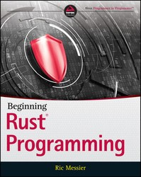

---

## > [**Hands-on Rust - Effective Learning through 2D Game Development and Play**](https://pragprog.com/titles/hwrust/hands-on-rust/)  

by Herbert Wolverson  
Edition: 1 - Published: July 2021 - ISBN: 9781680508161  

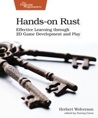

---

[Programming WebAssembly with Rust - Unified Development for Web, Mobile, and Embedded Applications](https://pragprog.com/titles/khrust/programming-webassembly-with-rust/)  

by Kevin Hoffman  
Edition: 1 - Published: March 2019 - ISBN: 9781680506365  

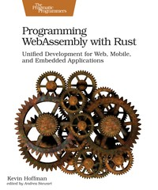

---

[Rust Brain Teasers - Exercise Your Mind](https://pragprog.com/titles/hwrustbrain/rust-brain-teasers/)  

by Herbert Wolverson  
Edition: 1 - Published: March 2022 - ISBN: 9781680509175  

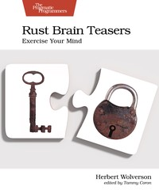

---

## > [**Rust in Action Systems programming concepts and techniques**](https://www.manning.com/books/rust-in-action)  

Tim McNamara  
June 2021 - ISBN 9781617294556  

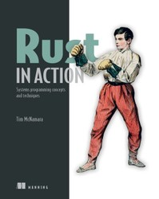

---

[Rust Web Development](https://www.manning.com/books/rust-web-development?query=rust)  

Bastian Gruber  
Fall 2022 - ISBN 9781617299001

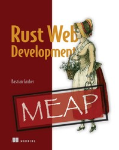

---

[Rust Servers, Services, and Apps](https://www.manning.com/books/rust-servers-services-and-apps?query=rust)  

Prabhu Eshwarla  
Fall 2022 - ISBN 9781617298608

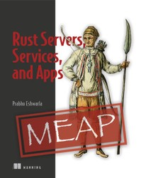

---

[Code Like a Pro in Rust](https://www.manning.com/books/code-like-a-pro-in-rust?query=rust)  

Brenden Matthews  
Early 2023 - ISBN 9781617299643

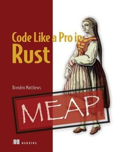

---

[Zero To Production In Rust An introduction to backend development](https://www.zero2prod.com/)  

Luca Palmieri 
n/a - ISBN: n/a

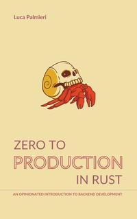

---

[Programming Rust, 2nd Edition](https://www.oreilly.com/library/view/programming-rust-2nd/9781492052586/)  

by Jim Blandy, Jason Orendorff, Leonora F. S. Tindall  
June 2021 - ISBN: 9781492052593

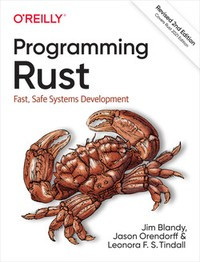

---

[Command-Line Rust](https://www.oreilly.com/library/view/command-line-rust/9781098109424/)  

Ken Youens-Clark  
January 2022 - ISBN 9781098109431

---

[Beginning Rust: Get Started with Rust 2021 Edition](https://www.oreilly.com/library/view/beginning-rust-get/9781484272084/)  
by Carlo Milanesi  
January 2022 - ISBN 9781484272084  
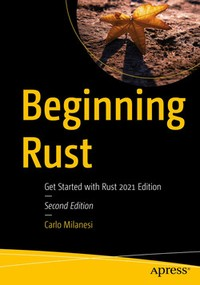

---

[Rust Web Programming](https://www.oreilly.com/library/view/rust-web-programming/9781800560819/)  
by Maxwell Flitton  
February 2021 - ISBN: 9781800560819  
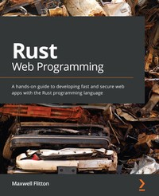

---

[Speed Up Your Python with Rust](https://www.oreilly.com/library/view/speed-up-your/9781801811446/)  
by Maxwell Flitton  
January 2022 - ISBN: 9781801811446  
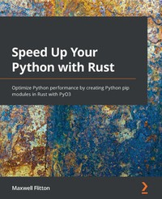

---

[Practical System Programming for Rust Developers](https://www.oreilly.com/library/view/practical-system-programming/9781800560963/)  
by Prabhu Eshwarla  
December 2020 - ISBN: 9781800560963  
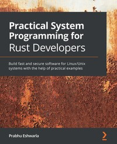

---

[Rust for Rustaceans](https://www.oreilly.com/library/view/rust-for-rustaceans/9781098129828/)  
by Jon Gjengset  
December 2021 - ISBN: 9781718501850  
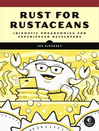

---

[Practical Machine Learning with Rust: Creating Intelligent Applications in Rust](https://www.oreilly.com/library/view/practical-machine-learning/9781484251218/)  
by Joydeep Bhattacharjee  
December 2019 - ISBN: 9781484251218  
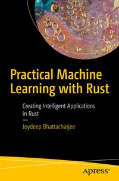

---

[Network Programming with Rust](https://www.oreilly.com/library/view/network-programming-with/9781788624893/)  
by Abhishek Chanda  
February 2018 - ISBN: 9781788624893  
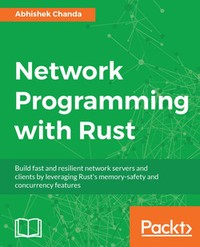

---

[Rust Programming Cookbook](https://www.oreilly.com/library/view/rust-programming-cookbook/9781789530667/)  
by Claus Matzinger  
October 2019 - ISBN: 9781789530667  
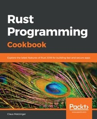

---

[Hands-On Microservices with Rust](https://www.oreilly.com/library/view/hands-on-microservices-with/9781789342758/)  
by Denis Kolodin  
January 2019 - ISBN: 9781789342758  
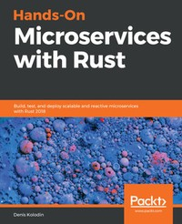

---

[Creative Projects for Rust Programmers](https://www.oreilly.com/library/view/creative-projects-for/9781789346220/)  
by Carlo Milanesi  
June 2020 - ISBN: 9781789346220  
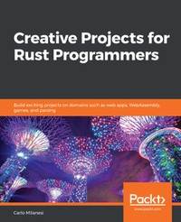

---

[Hands-On Data Structures and Algorithms with Rust](https://www.oreilly.com/library/view/hands-on-data-structures/9781788995528/)  
by Claus Matzinger  
January 2019 - ISBN: 9781788995528  
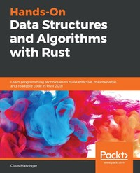

---

[Practical Rust Projects: Building Game, Physical Computing, and Machine Learning Applications](https://www.oreilly.com/library/view/practical-rust-projects/9781484255995/)  
by Shing Lyu  
February 2020 - ISBN: 9781484255995  
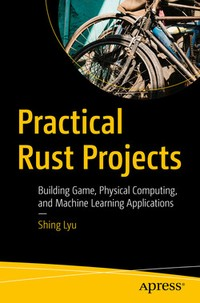

---

[Practical Rust Web Projects: Building Cloud and Web-Based Applications](https://www.oreilly.com/library/view/practical-rust-web/9781484265895/)  
by Shing Lyu  
January 2021 - ISBN: 9781484265895  
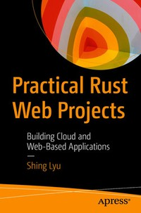

---

[Mastering Rust - Second Edition](https://www.oreilly.com/library/view/mastering-rust/9781789346572/)  
by Rahul Sharma, Vesa Kaihlavirta  
January 2019 - ISBN: 9781789346572  
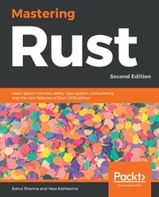

---

Getting Started with Secure Embedded Systems: Developing IoT Systems for micro:bit and Raspberry Pi Pico Using Rust and Tock
https://www.oreilly.com/library/view/getting-started-with/9781484277898/
by Alexandru Radovici, Ioana Culic
Released January 2022
Publisher(s): Apress
ISBN: 9781484277898
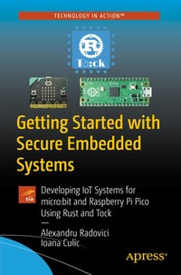

---

Rust for the IoT: Building Internet of Things Apps with Rust and Raspberry Pi
https://www.oreilly.com/library/view/rust-for-the/9781484258606/
by Joseph Faisal Nusairat
Released September 2020
Publisher(s): Apress
ISBN: 9781484258606
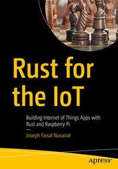

---

Rust Standard Library Cookbook
https://www.oreilly.com/library/view/rust-standard-library/9781788623926/
by Jan Nils Ferner, Daniel Durante
Released March 2018
Publisher(s): Packt Publishing
ISBN: 9781788623926
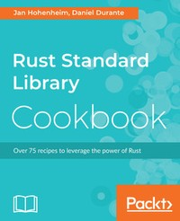

---

Hands-On Functional Programming in Rust
https://www.oreilly.com/library/view/hands-on-functional-programming/9781788839358/
by Andrew Johnson
Released May 2018
Publisher(s): Packt Publishing
ISBN: 9781788839358
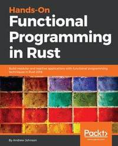

---

Rust Programming By Example
https://www.oreilly.com/library/view/rust-programming-by/9781788390637/
by Guillaume Gomez, Antoni Boucher
Released January 2018
Publisher(s): Packt Publishing
ISBN: 9781788390637
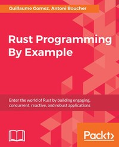

---

Rust High Performance
https://www.oreilly.com/library/view/rust-high-performance/9781788399487/
by Iban Eguia Moraza
Released March 2018
Publisher(s): Packt Publishing
ISBN: 9781788399487
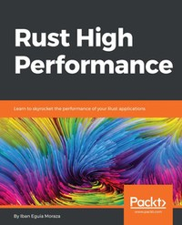

---

Hands-On Concurrency with Rust
https://www.oreilly.com/library/view/hands-on-concurrency-with/9781788399975/
by Brian L. Troutwine
Released May 2018
Publisher(s): Packt Publishing
ISBN: 9781788399975
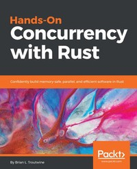

---

Fullstack Rust
https://www.newline.co/fullstack-rust
Andy Weiss
