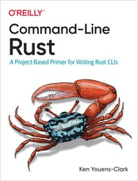

## Books

### > [**Beginning Rust Programming**](https://www.wiley.com/en-gb/Beginning+Rust+Programming-p-9781119712978)  

Ric Messier  
April 2021 - ISBN: 978-1-119-71297-8  

---

### > [**Hands-on Rust - Effective Learning through 2D Game Development and Play**](https://pragprog.com/titles/hwrust/hands-on-rust/)  

by Herbert Wolverson  
Edition: 1 - Published: July 2021 - ISBN: 9781680508161  

---

[Programming WebAssembly with Rust - Unified Development for Web, Mobile, and Embedded Applications](https://pragprog.com/titles/khrust/programming-webassembly-with-rust/)  

by Kevin Hoffman  
Edition: 1 - Published: March 2019 - ISBN: 9781680506365  

---

[Rust Brain Teasers - Exercise Your Mind](https://pragprog.com/titles/hwrustbrain/rust-brain-teasers/)  

by Herbert Wolverson  
Edition: 1 - Published: March 2022 - ISBN: 9781680509175  

---

### > [**Rust in Action Systems programming concepts and techniques**](https://www.manning.com/books/rust-in-action)  

Tim McNamara  
June 2021 - ISBN 9781617294556  

---

[Rust Web Development](https://www.manning.com/books/rust-web-development?query=rust)  

Bastian Gruber  
Fall 2022 - ISBN 9781617299001

---

[Rust Servers, Services, and Apps](https://www.manning.com/books/rust-servers-services-and-apps?query=rust)  

Prabhu Eshwarla  
Fall 2022 - ISBN 9781617298608

---

[Code Like a Pro in Rust](https://www.manning.com/books/code-like-a-pro-in-rust?query=rust)  

Brenden Matthews  
Early 2023 - ISBN 9781617299643

---

[Zero To Production In Rust An introduction to backend development](https://www.zero2prod.com/)  

Luca Palmieri 
n/a - ISBN: n/a

---

[Programming Rust, 2nd Edition](https://www.oreilly.com/library/view/programming-rust-2nd/9781492052586/)  

by Jim Blandy, Jason Orendorff, Leonora F. S. Tindall  
June 2021 - ISBN: 9781492052593

---

[Command-Line Rust](https://www.oreilly.com/library/view/command-line-rust/9781098109424/)  

Ken Youens-Clark  
January 2022 - ISBN 9781098109431

---

[Beginning Rust: Get Started with Rust 2021 Edition](https://www.oreilly.com/library/view/beginning-rust-get/9781484272084/)  
by Carlo Milanesi  
January 2022 - ISBN 9781484272084  

---

[Rust Web Programming](https://www.oreilly.com/library/view/rust-web-programming/9781800560819/)  
by Maxwell Flitton  
February 2021 - ISBN: 9781800560819  

---

[Speed Up Your Python with Rust](https://www.oreilly.com/library/view/speed-up-your/9781801811446/)  
by Maxwell Flitton  
January 2022 - ISBN: 9781801811446  

---

[Practical System Programming for Rust Developers](https://www.oreilly.com/library/view/practical-system-programming/9781800560963/)  
by Prabhu Eshwarla  
December 2020 - ISBN: 9781800560963  

---

[Rust for Rustaceans](https://www.oreilly.com/library/view/rust-for-rustaceans/9781098129828/)  
by Jon Gjengset  
December 2021 - ISBN: 9781718501850  
